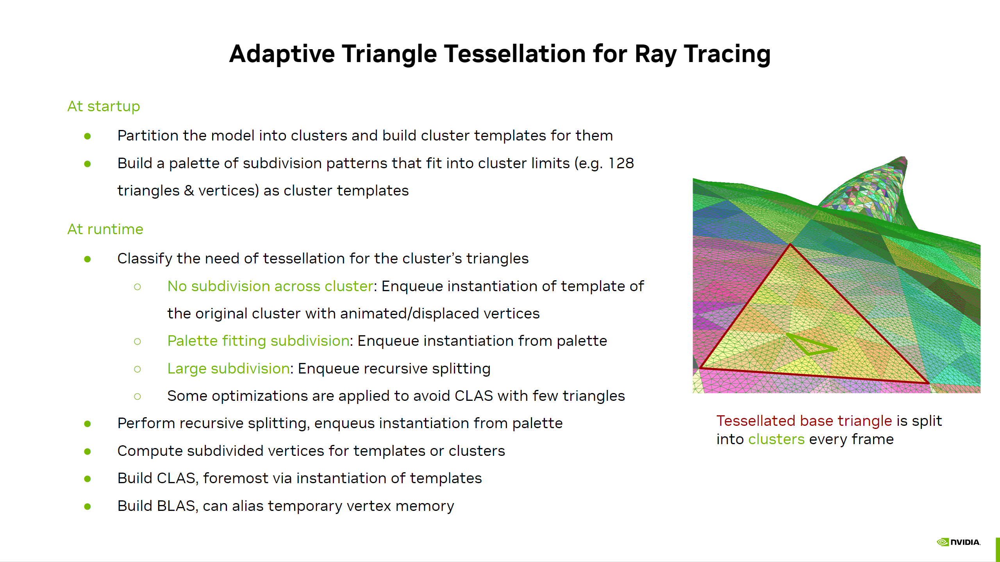
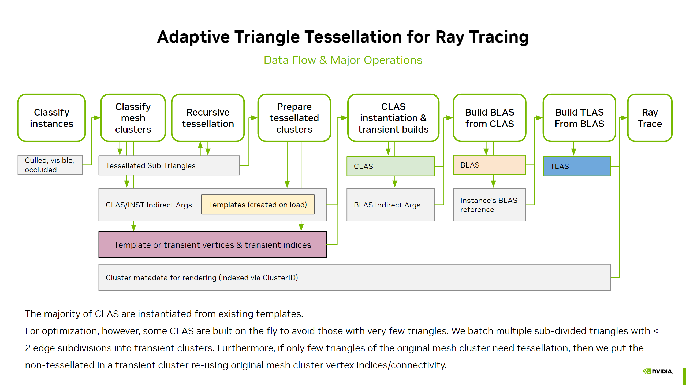

# vk_tessellated_clusters

This sample showcases dynamic tessellation with displacement that requires per-frame generation of clusters for ray tracing using `VK_NV_cluster_acceleration_structure`.
It can also render the content using `VK_NV_mesh_shader`.

Please have a look at the [vk_animated_clusters](https://github.com/nvpro-samples/vk_animated_clusters) sample prior this, to familiarize yourself with the new cluster extension.



## Dynamic tessellation

The principle steps for both rasterization and ray tracing are similar. The key difference is that rasterization 
directly generates the rendered vertices and triangle data within the meshlet, whilst ray tracing has to write
out vertices and build cluster acceleration structures (CLAS) for use in bottom level acceleration structures (BLAS).

Note that to reduce workload we skip tessellating instances that are not "primary visible" (outside frustum, or occluded).
This can mean that shadows of such instances change as they become visible.

### Model processing

This sample is using the same cluster generation as `vk_animated_clusters` for the loaded models. The key difference is that due to the dynamic nature of this sample,
we always generate **cluster templates** for the original geometry and they always use `VK_BUILD_ACCELERATION_STRUCTURE_PREFER_FAST_TRACE_BIT_KHR`.
The ray tracing template data structures are built in [`raytracing_cluster_data.cpp`](src/raytracing_cluster_data.cpp).

### Tessellation Table

To allow experimenting with different tessellation patterns, the table is embedded into the source code as a header file, feel free to generate your own.
We recommend not exceeding 128 triangles / vertices for the highest tessellation factor. This is why the current table is maxed to 11 segments per triangle edge.

The raw table header file is defined as follows

``` cpp
namespace tessellation_table {
uint32_t max_edge_segments = 11; // number of segments per edge (we recommend <= 11)
uint32_t max_vertices = ...; // total number of vertices across all subdivision patterns
uint32_t vertices[] = {
    // each vertex is stored as uint32_t, a UV coordinate is packed in pairs of 16-bit values
    // 0 = 0.0f
    // 1 << 15 == 1.0f

    // the first non-subdivided triangle's UVs are:
    // (0,0),     (1,0),     (0,1) and stored as:
    // 0x00000000,0x00008000,0x80000000
    ...
};
uint32_t max_triangles = ...; // total number of triangles across all subdivision patterns
uint32_t triangles[] = {
    // each triangle is stored packed in a single uint32_t, where the
    // first 24 bits store 3 x 8 bit counter-clockwise vertex indices and the top 8 bits are unused.
    // The vertex indices are relative to the config's `firstVertex`, see later.

    // the first triangle indices are [0,1,2] stored as 0x00020100
    ...
};
uint32_t max_configs = ...; // sum of all tessellation configs
uint16_t configs[] = {
    // each tessellation config is stored as 4 uint16_t values
    // and defines the triangulation of the config

    // u16 firstTriangle (offset into triangles[])
    // u16 firstVertex (offset into vertices[])
    // u16 numTriangles
    // u16 numVertices
    ...
};

// The configs are stored with increasing edge segments.
// We make use of symmetry and therefore only the permutations
// with edge N segments >= edge N+1 segments need to be stored.
// 
// `edge N` is from `vertex N` to `(vertex N+1) % N` of the triangle

// config: index - edge 0, edge 1, edge 2 segments
// 
// config: 0 - 1, 1, 1  (1 segment for all triangle edges)
// config: 1 - 2, 1, 1  (2 segments for edge 0 and 1 segment for the others)
// config: 2 - 2, 2, 1  (2 segments for edge 0 and edge 1, 1 segment for edge 2)
// config: 3 - 2, 2, 2  (2 segments for all edges)
// config: 4 - 3, 1, 1  ...
// config: 5 - 3, 2, 1
// config: 6 - 3, 2, 2
// config: 7 - 3, 3, 1
// config: 8 - 3, 3, 2
// config: 9 - 3, 3, 3
// ...

// Caveat: for the TRANSIENT2X optimization to work (see later)
// all configs <= 2,2,2 must have <= TESS_2X_MINI_TRIANGLES (4)
//                            and <= TESS_2X_MINI_VERTICES (6)

} // namespace tessellation_table
```

The runtime table `TessellationTable` contains the raw data for use in mesh-shaders, or when interpreting the data directly. But it also contains **cluster templates** information.

``` cpp
// BUFFER_REF expands to uint64_t in C++ and to the provided `buffer_reference` type in GLSL

struct TessellationTable
{
  BUFFER_REF(uints_in)           vertices;  // u,v barycentrics packed as 2 x 16 bit, 1 << 15 represents 1.0
  BUFFER_REF(uints_in)           triangles; // 3 x 8 bit indices packed in 32 bit

  // these arrays are indexed by a power of 2 lookup table logic, so that we can quickly
  // find patterns for a triangle that is subdivided e.g. 11 x 7 x 10

  BUFFER_REF(TessTableEntrys_in) entries;           // lookup table for each pattern's vertices and triangles
  BUFFER_REF(uint64s_in) templateAddresses;         // cluster template addresses for that pattern
  BUFFER_REF(uints_in) templateInstantiationSizes;  // max cluster instantiation size for the pattern
};
```

Just like for the regular geometry we pre-generate the **cluster templates** for each pattern.

> NOTE: Special thanks to [**Epic Games**](https://www.epicgames.com/) for allowing the usage of a tessellation table that was derived from `Unreal Engine 5.4`.
> Brian Karis from Epic Games designed the specifics of the triangle distribution as well as indexing logic that re-uses the patterns efficiently.
> This sample reduced the upper size of the table to 11 segments to fit within 128 triangles per cluster.
> While they derived the re-use of patterns independently, Brian Karis pointed to [Optimized Pattern-Based Adaptive Mesh Refinement Using GPU by Lenz et al.](https://www.researchgate.net/publication/221337741_Optimized_Pattern-Based_Adaptive_Mesh_Refinement_Using_GPU), who developed the same optimization and they
> refer to [A Flexible Kernel for Adaptive Mesh Refinement on GPU by Boubekeur et al.](https://inria.hal.science/inria-00260825/document/) for the principle setup of using tables.

### Runtime Operations



To build the content we actually render, a series of dispatches and/or indirect build operations are performed.

Next to the kernel files that are mentioned for the steps, these are the main files to look at:
- [`shaders/common.h`](shaders/common.h): All data structures that are used by host and device can be found in `namespace shaderio` within this file.
- [`renderer_raster_clusters_tess.cpp`](src/renderer_raster_clusters_tess.cpp): The renderer that implements rasterization using `VK_NV_mesh_shader`.
- [`renderer_raytrace_clusters_tess.cpp`](src/renderer_raytrace_clusters_tess.cpp): The renderer that implements ray tracing using `VK_NV_cluster_acceleration_structure`.

All relevant indirect dispatches, and lists of pointers or structs are stored in the `shaderio::SceneBuilding` struct.

``` cpp

// re-ordered for readability! doesn't match code

struct SceneBuilding
{
  uint numRenderInstances;
  
  // result of classifying instances
  BUFFER_REF(uints_inout) instanceStates;

  // result of traversal / culling
  uint                           visibleClusterCounter;
  BUFFER_REF(ClusterInfos_inout) visibleClusters;

  // indirect launch for classifying clusters
  DispatchIndirectCommand dispatchClassify;

  // clusters to be rendered as is without subdivision
  uint                                fullClusterCounter;
  BUFFER_REF(ClusterInfos_inout)      fullClusters;

  // triangle to be rendered (subdivision fits in table)
  uint                                partTriangleCounter;
  BUFFER_REF(TessTriangleInfos_inout) partTriangles;

  // triangle to be split (subdivision too big)
  // this list is updated during a recursive splitting as well.
  int                                 splitTriangleCounter;
  uint                                splitReadCounter;
  uint                                splitWriteCounter;
  BUFFER_REF(TessTriangleInfos_coh)   splitTriangles;

  // rasterization
  // -------------

  DrawMeshTasksIndirectCommandNV drawFullClusters;
  DrawMeshTasksIndirectCommandNV drawPartTriangles;
  
  // ray tracing
  // -----------

  DispatchIndirectCommand dispatchClusterInstantiate;
  DispatchIndirectCommand dispatchTriangleInstantiate;

  // Storage for all generated clusters:

  // Generated vertices are needed for template instantiations or transient cluster builds.
  // For transient cluster builds, we also store the 3 x 8-bit triangle indices in this buffer.
  uint                                          genVertexCounter;
  BUFFER_REF(vec3s_inout)                       genVertices;

  // The number of clusters we build or instantiate in total, as well
  // as the reserved size they will use. We use explicit cluster building and
  // template instantiations, both
  uint     genClusterCounter;
  uint64_t genClusterDataCounter;

  uint64_t genClusterData; // base address for all generated clusters

  // We generate clusters either through template instantiations or 
  // transient builds.

  // the actual number of templates we will instantiate
  uint     tempInstantiateCounter;
  // the actual number of transient clusters we will build
  uint     transBuildCounter;

  // for each template instantiation:
  BUFFER_REF(uints_inout)                       tempInstanceIDs;      // need to know which render instance it came from
  BUFFER_REF(TemplateInstantiateInfos_inout)    tempInstantiations;   // for each template the instantiation arguments
  BUFFER_REF(uint64s_inout)                     tempClusterAddresses; // explicit target address for this cluster
  BUFFER_REF(uints_inout)                       tempClusterSizes;     // after instantiation, output size (only used for statistics)

  // for each transient cluster build (same as above)
  BUFFER_REF(uints_inout)                       transInstanceIDs;
  BUFFER_REF(ClusterBuildInfos_inout)           transBuilds;
  BUFFER_REF(uint64s_inout)                     transClusterAddresses;
  BUFFER_REF(uints_inout)                       transClusterSizes;

  // dispatch setup to fill the instantiated template clusters into the blas lists
  DispatchIndirectCommand dispatchBlasTempInsert;
  // dispatch setup to fill the transient built clusters into the blas lists
  DispatchIndirectCommand dispatchBlasTransInsert;

  // a large array of cluster addresses, but now sectioned by blas
  // the values will come from `tempClusterAdresses` and
  // `blasBuildInfos[].clusterReferences` will point into this
  BUFFER_REF(uint64s_inout)              blasClusterAddresses; 


  // for each render instance, we generate a blas
  BUFFER_REF(ClusterBlasBuildInfo_inout) blasBuildInfos;  // blas build arguments
  BUFFER_REF(uints_inout)                blasBuildSizes;  // after build, size (only used for statistics)

  uint64_t blasBuildData;     // storage of cluster data (not really used, we use implicit builds)

  uint numBlasReservedSizes;  // just for statistics
};
```

1. **Classify Instances**
    For each instance we determine if the entire instance is within frustum and/or visible (not occluded). See [instances_classify.comp.glsl](shaders/instances_classify.comp.glsl). The occlusion determination is kept simple and we use the last frame's HiZ and projection information.

    Instances that are fully outside frustum, or fully occluded from the camera will not receive tessellation.

    |Input | Output |
    |------|--------|
    |Instance | `instanceStates[]`  |

2. **Culling of Scene Clusters**
    A series of compute shader dispatches collect all visible clusters. Optionally frustum and occlusion culling is performed. See [clusters_cull.comp.glsl](shaders/clusters_cull.comp.glsl). The occlusion culling is kept simple and we use the last frame's HiZ and projection information.

    |Input | Output |
    |------|--------|
    |Geometry | `visibleClusters[]` & counter |
    | `instanceStates[]` | |

3. **Build Setup `BUILD_SETUP_CLASSIFY`**
   
    This compute shader simply sets up the indirect dispatch for the next operation. It clamps the actual number of visible clusters to what can be stored in buffers. See
    [build_setup.comp.glsl](shaders/build_setup.comp.glsl).
    
    |Input | Output |
    |------|--------|
    |`visibleClusterCounter` | `dispatchClassify.gridX` |

4. **Classify Cluster**
   
    The visible clusters are classified regarding their tessellation status, see [cluster_classify.comp.glsl](shaders/cluster_classify.comp.glsl).
    We transform the cluster vertices into shared memory and then determine the tessellation factors for every triangle within the cluster.
    If all triangles are "simple" (i.e 1 x 1 x 1 segments) then the entire cluster is treated as "full cluster".

    For ray tracing this means we directly setup the instantiation arguments of this cluster, and copy the vertices from shared memory to the allocated
    global memory. This is only done if we can ensure enough space is available in the temporary arrays. In rasterization we append into `fullClusters[]`.

    Triangles that are subdivided small enough to fit in the tessellation table, are sent to the `partTriangles[]` list.
    Those that are too big and require recursive splitting are sent to `splitTriangles[]`.

    For ray tracing the sample can apply some optional optimizations in this step by building **transient clusters**, the goal is to create less
    clusters per frame, and increase the number of triangles within the generated clusters. This is an important optimization for ray tracing.
    Without these optimizations, all clusters are built through template instantiations.
    
    The ui option `use transient == 1x1x1` triggers the building of a transient cluster with all triangles that are simple, in case
    the entire cluster wasn't classified simple. This avoids generating lots of template instantiations with just 1 triangle.
    The triangle indices used for such transient cluster builds are stored within `genVertices[]` simply after the vertices.

    When this codepath is triggered, we also store slightly different information in the `partTriangles[]` array to be able
    to map the transient cluster's triangles (now less than the original cluster) back to the original triangle IDs. Multiple consecutive elements within `partTriangles[]` may be used
    to store this uint8 array. Effectively we store `uint instanceID; uint clusterID; uint8_t triMappings[];`

    The second ui option `use transient <= 2x2x2` can be enabled independently of the first, and batches every few lowly-subdivided triangles into a
    transient cluster build. This time `partTriangles[]` stores `uint instanceID; uint clusterID; uint16_t triInfos[];` where the `triInfos[]` array allows
    us to map every generated subdivided triangle back to the original cluster triangle, as well as which subdivision factors were used and the relative triangle index
    within the subdivision. This information is later needed to generate appropriate UV coordinates within the hit shader.


    |Input | Output |
    |------|--------|
    |`visibleClusters[]`                             | `fullClusters[]` & counter (raster only) |
    |`instanceStates[]`                              | `partTriangles[]`                        |
    |Geometry vertices, triangles, clusters..        | `splitTriangles[]` & counter             |
    |                                                | `genVertices[]` & counter                |
    |                                                | `genClusterCounter`                      |
    |                                                | `genClusterDataCounter`                  |
    |`geometry[].clusterTemplateAdresses[]`          | `tempInstantiations[]` & counter         |
    |`geometry[].clusterTemplateInstantiatonSizes[]` | `tempInstanceIDs[]`                      |
    |                                                | `tempClusterAddresses[]`                 |
    |                                                | `transBuilds[]` & counter                |
    |                                                | `transInstanceIDs[]`                     |
    |                                                | `transClusterAddresses[]`                |
    |                                                | `blasBuildInfos[instanceID].clusterReferencesCount` |

5. **Build Setup `BUILD_SETUP_SPLIT`**
   
    Clamp the counters to ensure we don't exceed splitting work. Setup index for output writes.

    |Input | Output |
    |------|--------|
    |`splitTriangleCounter` | `splitTriangleCounter` |
    |                       | `splitWriteCounter` (matches above) |

6. **Triangle Split**
   
    Recursively split every triangle whose subdivision is too high to expressed by the tessellation table,
    see [triangle_split.comp.glsl](shaders/triangle_split.comp.glsl).

    We generate partial triangles and encode their barycentric positioning with the original triangle.
    The `splitTriangles[]` list as well as read/write counters are modified in this process. Every child
    of a split triangle is classified again whether it needs splitting or can be sent to `partTriangles[]`.

    |Input | Output |
    |------|--------|
    |`splitTriangles[]` & counter              | `partTriangles[]` & counter |
    |                                          | `splitTriangles[]` & counter (recursive) |
    | `splitWriteCounter` & `splitReadCounter` | `splitWriteCounter` & `splitReadCounter` (recursive) |

7. **RASTER ONLY - Indirect Setup `BUILD_SETUP_DRAW_TESS`**
   
    Setup the indirect draw calls for both partial triangles and full clusters.

    |Input | Output |
    |------|--------|
    |`partTriangleCounter` | `drawFullClusters` |
    |`partTriangleCounter` | `drawPartTriangles` |

8. **RASTER ONLY - Draw Scene - RASTER MOSTLY ENDS HERE**
   
    Draw the full clusters via [render_raster_clusters.mesh.glsl](shaders/render_raster_clusters.mesh.glsl) and the partial either via [render_raster_clusters_tess.mesh.glsl](shaders/render_raster_clusters_tess.mesh.glsl) or a task/mesh combination of [render_raster_clusters_batched.task.glsl](shaders/render_raster_clusters_batched.task.glsl) and [render_raster_clusters_batched.mesh.glsl](shaders/render_raster_clusters_batched.mesh.glsl).

    These "batched" shaders are used by default and their usage is controlled by the ui option `batch meshlets` in the rasterization settings. The batching is conceptually similar to the "transient" clusters in the ray tracing case, however it's broader in use and will combine any tessellation levels. The [task shader](shaders/render_raster_clusters_batched.task.glsl) looks at 32 partial triangles and then tries to batch multiple of them as long as the sum of their triangles and vertices fit into the meshlet (`TESS_RASTER_BATCH_VERTICES = 96` and `TESS_RASTER_BATCH_TRIANGLES = 128`).
    The subsequent [mesh shader](shaders/render_raster_clusters_batched.mesh.glsl) then computes a total sum of work items for vertices and triangles that its subgroup iterates over. It does a dense packing of the work, so we don't waste SIMT utilization.

    |Input | Output |
    |------|--------|
    |`drawFullClusters` | the most exciting pixels ever |
    |`drawPartTriangles`|  |
    |`fullClusters[]`   |  |
    |`partTriangles[]`  |  |

9. **Build Setup `BUILD_SETUP_INSTANTIATE_TESS`**
   
    Setup the next kernel for the partial triangle template preparation.

    |Input | Output |
    |------|--------|
    |`partTriangleCounter` | `dispatchTriangleInstantiate` |

10. **Prepare Instantiation**
   
    Fills the template instantiation arguments and temporary vertices for partial triangles, see [triangle_tess_template_instantiate.comp.glsl](shaders/triangle_tess_template_instantiate.comp.glsl).
    This time the generated vertices are within a triangle, and based on the barycentric vertices of the tessellation table as well as the region the partial triangle covers.
    Each partial triangle provides the region via `TessTriangleInfo::subTriangle.vtxEncoded[]` and the subdivision configuration via `TessTriangleInfo::subTriangle.triangleID_config`.

    Just like in classify we ensure we don't exceed reserved data.

    To make better use of the threads in the workgroup, we batch the processing of multiple partial triangles into one workgroup.
    This batching is controlled via `TESS_INSTANTIATE_BATCHSIZE`. Without such batching we risk under utilizing the hardware a lot, given for example a low resolution sub triangle might only generate 4 vertices, wasting a lot of the default workgroup's 64 threads.

    We suggest to read the code with `TESS_INSTANTIATE_BATCHSIZE == 1` first, to easier understand what it does. With higher batch sizes
    the kernel first computes the sum of threads needed over all partial triangles, and then loops the workgroup's threads until this sum is reached. During the loop it figures out which of the batches' partial triangle each thread does contribute to and which subdivided vertex is computed.
    
    Note: The instantiated template clusters will have a clusterID that is tagged (highest two bits) and then the clusterID actually encodes to the index into `partTriangles[]`.
    That way during ray tracing we can find back the relevant information for this partial triangle.

    |Input | Output |
    |------|--------|
    |`partTriangles[]`                             |                                          |
    |Geometry vertices, triangles, clusters..      |                                          |
    |`tessTable.templateAdresses[]`                | `tempInstantiations[]` & counter         |
    |`tessTable.templateInstantiationSizes[]`      | `tempInstantiateDataCounter`             |
    |                                              | `tempInstanceIDs[]`                      |
    |                                              | `genVertices[]` & counter                |
    |                                              | `blasBuildInfos[instanceID].clusterReferencesCount` |

11. **Build Setup `BUILD_SETUP_BUILD_BLAS`**
   
    Setup counter of actual instantiation as well as transient cluster builds, and also the 
    dispatch kernels that insert the cluster addresses into the per-blas input lists.

    |Input | Output |
    |------|--------|
    |`tempInstantiateCounter`     | `dispatchBlasTempInsert` |
    |`transBuildCounter`          | `dispatchBlasTransInsert`  |

12. **Template Instantiation && Transient Cluster Builds**
    
    Via `vkCmdBuildClusterAccelerationStructureIndirectNV` we instantiate or build all transient clusters to be used as input for the blas builds.

    Note: after instantiation we can toss away the `genVertices` and other inputs to the cluster build. That is why you
    will see that the sample overlaps the `blasBuildData` memory with this temporary transient data.

    **Template Instantiation**

    |Input | Output |
    |------|--------|
    |`tempInstantiations[]` & counter | `tempClusterSizes[]` |
    |`tempClusterAddresses[]`         | `genClusterData` explicit build |
    |`genVertices[]`                  |  |
    |`tessTable.templateData`         |  |
    |`geometry[].clusterTemplateData` |  |

    **Transient Cluster Builds**

    |Input | Output |
    |------|--------|
    |`transBuilds[]` & counter        | `transClusterSizes[]` |
    |`transClusterAddresses[]`        | `genClusterData` explicit build |
    |`genVertices[]` (used for vertices & index data) |  |


11. **BlAS Setup - (Overlaps previous)** 
   
    This dispatch prepares the per-blas cluster reference lists, see [blases_build_setup.comp.glsl](shaders/blases_build_setup.comp.glsl)

    |Input | Output |
    |------|--------|
    |`blasBuildInfos[].clusterReferencesCount` | `blasClusterCounter` atomically add `.clusterReferencesCount` |
    |                                          | `blasBuildInfos[].clusterReferences` acquire new start address for this list based on above |
    |                                          | `blasBuildInfos[].clusterReferencesCount` reset to 0 |

12. **Cluster BlAS Insertion**
    
    After the clusters were built, distribute their resulting addresses across the per-blas lists, see [blas_clusters_insert.comp.glsl](shaders/blas_clusters_insert.comp.glsl). 
    Originally the addresses come in random ordering from different instances, but for BLAS build we need them in dedicated sections.

    The dispatch is run twice either with template or transient inputs.

    |Input | Output |
    |------|--------|
    | `tempInstanceIDs[]` or `transInstanceIDs[]`           | `blasBuildInfos[instanceID].clusterReferencesCount` atomically add `1` for each cluster |
    | `tempClusterAddresses[]` or `transClusterAddresses[]` | `blasBuildInfos[instanceID].clusterReferences[]` append based on above |

13. **BLAS Build**
    
    Through `vkCmdBuildClusterAccelerationStructureIndirectNV` we now build the BLAS over all render instances.

    |Input | Output |
    |------|--------|
    | `blasBuildInfos[]`           | `blasBuildData` implicit build |
    |                              | `rayinstances[].accelerationStructureReference` stores result blas address directly |
    |                              | `blasBuildSizes[]` only for stats |
    | `genClusterData` indirectly  | |

14. **TLAS Build**
    
    Now that all BLAS were built and assigned to each render instances we can build the TLAS. This is done by traditional `vkCmdBuildAccelerationStructuresKHR` see `Renderer::updateRayTracingTlas` 

    |Input | Output |
    |------|--------|
    | `rayinstances[]`             | `tlasData`|
    | `blasBuildData` indirectly   |           |
    | `genClusterData` indirectly  |           |

15. **Ray Tracing**
    
    Finally. We do a classic ray tracing pipeline launch via `vkCmdTraceRaysKHR`.

    Our hit shaders have to react whether they are hitting clusters from triangulated triangles, or regular geometry, see [render_raytrace_clusters.rchit.glsl](shaders/render_raytrace_clusters.rchit.glsl).
    We make use of `VK_KHR_ray_tracing_position_fetch` to avoid having to keep the `tempVertices` around. However, for ray tracing clusters that originated from tessellation, we have to keep `partTriangles[]` so we know which region of an original geometry triangle they cover. This is needed for computing the right barycentric weights, for example for texture coordinates or other interpolated attributes.

    |Input | Output |
    |------|--------|
    | Geometry vertices, triangles, clusters... | the most beautiful pixels ever |
    | `partTriangles[]`            |           |
    | `tlasData` indirectly        |           |
    | `blasBuildData` indirectly   |           |
    | `genClusterData` indirectly  |           |

16. **Depth Write**
    
    Converts the ray tracing depth to depth-buffer via fragment shader writing `gl_FragDepth` so internal hw acceleration structures are updated along.
    While this sample doesn't really rasterize geometry on top of ray tracing, common use-cases would. 

17. **HiZ - ALSO RASTER AGAIN**
    
    Create the HiZ texture based on current depth buffer.

## Displacement Texturing

The sample uses the unofficial glTF 2.0  [`KHR_materials_displacement`](https://github.com/KhronosGroup/glTF/issues/948) extension.
However, the samples is kept basic and doesn't support multiple texcoords or texture coordinate transforms.

Example of the extension:

``` cpp
...
"materials": [
{
    "extensions": {
    "KHR_materials_displacement": {
        "displacementGeometryFactor": 0.4,
        "displacementGeometryOffset": -0.2,
        "displacementGeometryTexture": {
        "index": 3
        }
    }
    },
...
```
## Problem-Solving

Flickering is expected to occur when the various intermediate data buffers do not provide enough space. Within the UI the appropriate statistics will change in color and a warning message will appear on the main viewport. This is typically addressed by raising the limits and providing more memory space.

The technology being quite new, we might not have ironed out all issues. If you experience instabilities, please let us know through GitHub Issues.
You can use the commandline to change some defaults:

* `-renderer 0` starts with rasterization.
* `-supersample 0` disables the super sampling that otherwise doubles rendering resolution in each dimension. 
* `-gridcopies N` set the number of model copies in the scene.
* `-tessrate F` set the float value of the tessellation rate in pixels per segment. `0` to disable.
* `-vsync 0` disable vsync. If changing vsync via UI does not work, try to use the driver's *NVIDIA Control Panel* and set `Vulkan/OpenGL present method: native`.

## Future Improvements

- Provide an alternative open-source tessellation table beyond the version derived from Unreal Engine.
- Adaptive tessellation based on culling results for ray tracing: It might be better to gradually reduce tessellation of invisible objects. Currently the sample does a per-instance decision that is binary and therefore shadows of an invisible object might pop if an object becomes visible. One could fade tessellation rate based on distance to frustum planes for instances outside, and for occluded objects a time-based fading could be used. Alternatively, the DirectX 12 sample on subdivision surface tessellation does use occlusion culling information on a per-patch level.
- The tessellation factors are calculated based on the un-displaced vertices to reduce complexity of the sample.
- EXT_mesh_shader support

## Limitations

* Facet shading is enforced when tessellation is active. Smooth normals are not available, as the sample doesn't do procedural perturbation of normals matching the displacement effect, nor does it have support for deformed normal maps when displacement maps are used. 
* The `ClusterID` can only be accessed in shaders using  `gl_ClusterIDNV` after enabling `VkRayTracingPipelineClusterAccelerationStructureCreateInfoNV::allowClusterAccelerationStructures` for that pipeline. We use `GL_EXT_spirv_intrinsics` rather than dedicated GLSL extension support that may come at later time.
* Few error checks are performed on out of memory situations, which can happen on higher _"render copies"_ values, or the complexity of the loaded scene
* If the cluster library generates clusters > 256 vertices, scene loading will fail. This should be addressed in future versions.
* The number of threads used in the persistent kernel is basd on a crude heuristic for now and was not evaluated to be the optimal amount.

## Building and Running

The new `VK_NV_cluster_acceleration_structure` extension requires new drivers, earliest release version is `572.16` from 1/30/2025.
The sample should run on older drivers with just rasterization available.

Point cmake to the `vk_tessellated_clusters` directory and for example set the output directory to `/build`.
We recommend starting with a `Release` build, as the `Debug` build has a lot more UI elements.

The cmake setup will download the `Stanford Bunny` glTF 2.0 model that serves as default scene.

It will also look for [`nvpro_core`](https://github.com/nvpro-samples/nvpro_core) either as subdirectory of the current project directory, or up to two levels above. If it is not found, it will automatically download the git repo into `/build/_deps`.
Note, that the repository of `nvpro_core` needs to be updated manually in case the sample is updated manually, as version mismatches could occur over time.

The Vulkan validation layers may interfere with extensions it doesn't know about, therefore it is currently disabled in debug builds.
This will be changed with future Vulkan SDKs.

## Further Samples about NVIDIA RTX Mega Geometry

Other Vulkan samples using the new extensions:
- https://github.com/nvpro-samples/vk_animated_clusters - showcases basic usage of new ray tracing cluster extension.
- https://github.com/nvpro-samples/vk_lod_clusters - provides a sample implementation of a basic cluster-lod based rendering and streaming system.
- https://github.com/nvpro-samples/vk_partitioned_tlas - New extension to manage incremental TLAS updates.

We also recommend having a look at [NVIDIA GameWorks RTX Mega Geometry (coming soon)](https://github.com/NVIDIAGameWorks/RTX-Megageometry), which demonstrates tessellation of subdivision surfaces in DirectX 12.

## Acknowledgements

We would like to thank [**Epic Games**](https://www.epicgames.com/) for allowing the use of their nanite tessellation table. Furthermore, the idea of using a persistent kernel,
that splits triangles recursively, was inspired from how `Unreal Engine 5.4` implements nanite tessellation.

## Third Party

[meshoptimizer](https://github.com/zeux/meshoptimizer) can be used for as alternative for clusterization, and is always used when the triangles within a cluster are re-ordered to improve triangle strips.

This sample uses [data](/thirdparty/epicgames_tessellation/tessellation_table_epicgames_raw.hpp) derived from `Unreal Engine` which uses its own licensing terms.

It uses a modified version of [cgltf](https://github.com/jkuhlmann/cgltf) by Johannes Kuhlmann. The unofficial [`KHR_materials_displacement`](https://github.com/KhronosGroup/glTF/issues/948) extension was added.

It also uses [dlib](http://dlib.net/dlib/server/server_http.cpp.html) by Davis E. King.
